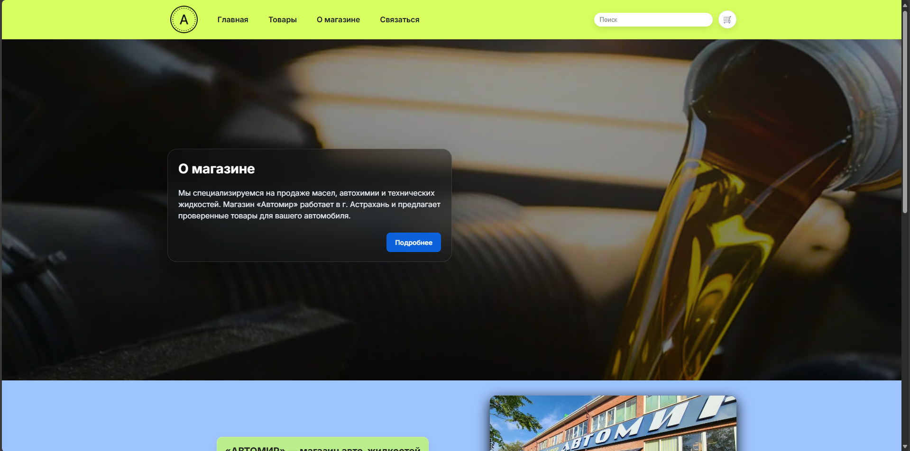
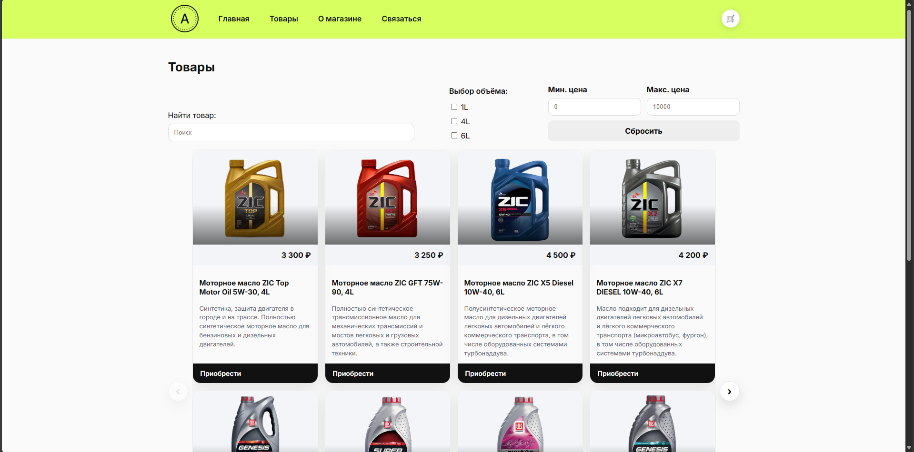
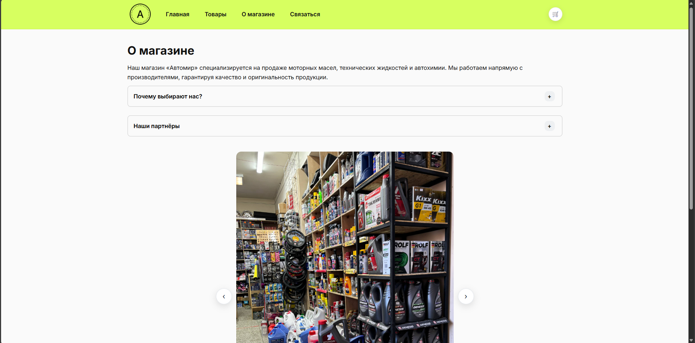
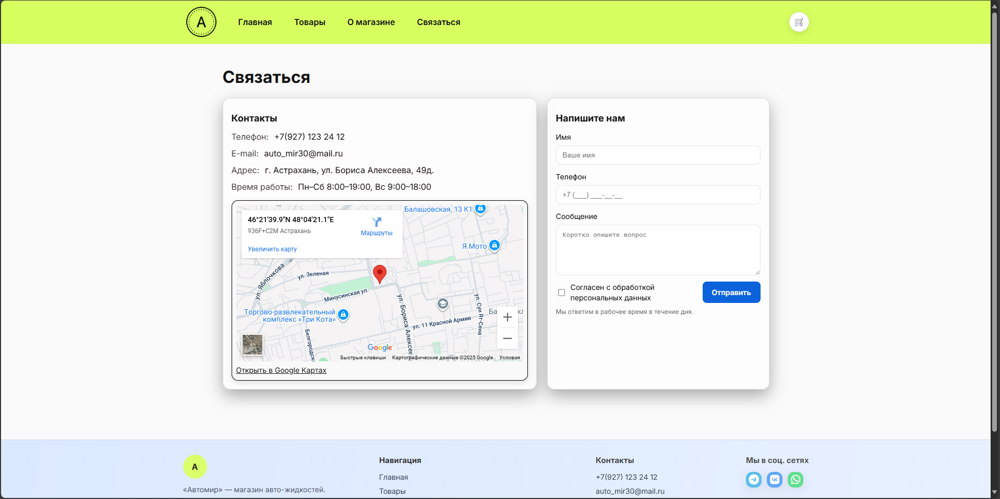

# Автомир — интернет-магазин автохимии и аксессуаров






Представляю сайт-витрину с карточками товаров, корзиной/мини-корзиной, поиском по каталогу, слайдерами и страницами «О магазине» и «Связаться».

> Живой демо (GitHub Pages): **https://vispir.github.io/avtomir-shop/**

> Репозиторий: **https://github.com/vispir/avtomir-shop**


---

## ✨ Возможности

- Главная: hero-слайдер + инфо-блок  
- Каталог: карточки, пагинация/листалка, **поиск** по названию  
- Товары: слайдер фотографий на карточке  
- Корзина: добавление/удаление, **мини-корзина** в шапке  
- О магазине: стеклянные карточки (glassmorphism), раскрывающиеся блоки «Почему выбирают нас?» и «Наши партнёры»  
- Связаться: контакты, **карта с белой карточкой и чёрной обводкой, форма для связи, а так же другая информация о магазине**  
- Адаптивная верстка, плавные анимации, hover-эффекты

---

## 🛠 Технологии

- **HTML5**, **CSS3** (Grid/Flex, glassmorphism), **Vanilla JS (ES6+)**
- Без фреймворков и бэкенда — чистый фронт!!!
- Статический деплой на **GitHub Pages**

---


# Avtomir — an online store for car care products and accessories

I present a showcase website with product cards, a shopping cart/mini-cart, catalog search, sliders, and "About" and "Contact" pages.

> Live demo (GitHub Pages): **https://vispir.github.io/avtomir-shop/**
>
> Repository: **https://github.com/vispir/avtomir-shop**

---

## ✨ Features

- Home: hero slider + info block
- Catalog: cards, pagination/scroller, **search** by name
- Products: photo slider on cards
- Cart: add/remove, **mini-cart** in the header
- About: glass cards (glassmorphism), expandable "Why choose us?" blocks and "Our Partners"
- Contact: contact information, **a map with a white card and black border, a contact form, and other store information**
- Responsive layout, smooth animations, hover effects

---

## 🛠 Technologies

- **HTML5**, **CSS3** (Grid/Flex, glassmorphism), **Vanilla JS (ES6+)**
- No frameworks or backend – a clean front end!!!
- Static deployment to **GitHub Pages**

---

## 🚀 Quick Start (Local)

```bash
# Clone
git clone https://github.com/YOUR_NICK/avtomir-shop.git
cd avtomir-shop

# Open index.html in a browser (or via the live server VS Code extension)
